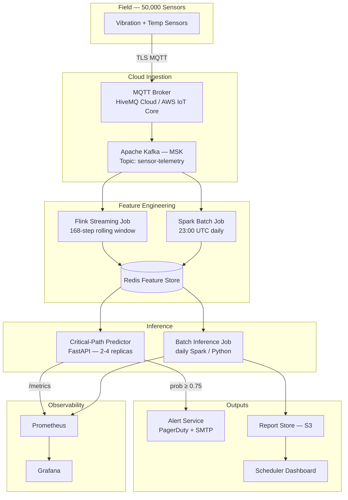

# Predictive Maintenance MLOps System — Scenario Y

## Executive Summary

This repository is the complete MLOps design dossier for a predictive maintenance inference system serving a factory-automation product. The system ingests vibration and temperature time-series from 50,000 industrial sensors via MQTT and runs a LightGBM classifier (`lgbm-predictive-maintenance`) to predict sensor failures within the next 72 hours. Results flow through two paths: a daily batch job that generates a maintenance report for schedulers (covering all 50,000 sensors), and a near-real-time alert pipeline that notifies on-call technicians within 5 minutes when a critical sensor's failure probability crosses a threshold. The design prioritises CPU-only compute, model immutability via baked-in artefacts, and strict coherence between every SLO, alert, and runbook so that a fresh on-call engineer can act on any firing alert without consulting anyone.

## Architecture Diagram

Full diagram with component annotations: [architecture/architecture.md](architecture/architecture.md)

## Key Numbers

| Metric | Value |
|---|---|
| Total sensors | 50,000 |
| Critical sensors (near-real-time path) | ~5,000 (10%) |
| Critical-path throughput | 20 RPS sustained · 40 RPS burst |
| HTTP p95 latency SLO | ≤ 120 ms |
| End-to-end alert latency SLO | p95 ≤ 300 s (5 min) |
| API availability SLO | 99.9 % (30-day rolling) |
| Batch success SLO | 99.5 % of daily runs |
| Model | LightGBM — `lgbm-predictive-maintenance` |
| Model artefact | `model.ubj` · 45 MB · **baked into image** |
| Container image (compressed) | ~320 MB |
| Hardware per replica | 2 vCPU / 4 GB · `c6i.large` |
| Replicas | 2 min → 4 max (HPA) |
| Monthly cost estimate | ≈ USD 280 |

## Navigation

| Area | Primary Artifact |
|---|---|
| Architecture | [architecture/architecture.md](architecture/architecture.md) |
| Pattern justification | [architecture/JUSTIFICATION.md](architecture/JUSTIFICATION.md) |
| ADR 0001 — Kafka + Flink | [architecture/adr/0001-stream-processing-kafka-flink.md](architecture/adr/0001-stream-processing-kafka-flink.md) |
| ADR 0002 — LightGBM | [architecture/adr/0002-lgbm-over-deep-learning.md](architecture/adr/0002-lgbm-over-deep-learning.md) |
| ML Lifecycle | [lifecycle/lifecycle.md](lifecycle/lifecycle.md) |
| Model Registry Spec | [lifecycle/model-registry.yaml](lifecycle/model-registry.yaml) |
| Dockerfile | [container/Dockerfile](container/Dockerfile) |
| Container Plan | [container/README.md](container/README.md) |
| OpenAPI Spec | [api/openapi.yaml](api/openapi.yaml) |
| API Examples | [api/examples/](api/examples/) |
| Capacity Plan | [serving/capacity-plan.md](serving/capacity-plan.md) |
| SLOs | [serving/slos.yaml](serving/slos.yaml) |
| Load-Test Plan | [serving/load-test-plan.md](serving/load-test-plan.md) |
| CI/CD Pipeline | [cicd/.github/workflows/deploy-model.yml](cicd/.github/workflows/deploy-model.yml) |
| Monitoring & Alerts | [monitoring/alerts.yaml](monitoring/alerts.yaml) |
| Rollback Runbook | [runbooks/rollback.md](runbooks/rollback.md) |

## Open Questions

1. **MQTT retention during broker outage.** Do sensors buffer locally if HiveMQ / AWS IoT Core is unavailable? If sensors can buffer for less than 5 minutes, the end-to-end alert latency SLO becomes unachievable during brownouts — we would need to revise the SLO or add an edge buffering layer.

2. **Critical-sensor list stability.** The ~5,000 "critical" sensors are modelled as a static configuration. If production schedules change which machines are critical on a daily basis, the Flink routing rules and Redis partitioning strategy both need redesigning before go-live.

3. **Label quality of maintenance logs.** The 72-hour failure prediction window assumes that technicians log confirmed failures with accurate timestamps. If repairs are retroactively logged (a common field reality), training labels will be systematically delayed and the AUC figures registered in MLflow will be optimistic, which affects the promotion gates.
