# ML Lifecycle

## End-to-End Diagram

```mermaid
flowchart TD
    subgraph Development["Development"]
        DC["Data Collection\nKafka replay — s3://acme-iot-data/sensor-features/\nDate range: rolling 12 months"]
        FE["Feature Engineering\nRolling stats: mean, std, RMS, peak\nFFT dominant frequency\nLinear trend slope over 7 d"]
        TRAIN["Model Training\nLightGBM + Optuna HPO\nc6i.2xlarge · < 5 min"]
        EVAL["Offline Evaluation\nAUC-ROC, Precision@0.5, F1\nHeld-out 90-day test set\nSHAP summary plot generated"]
        LOG["Log to MLflow\nparams, metrics, artefacts:\nmodel.ubj, model.ubj.sha256,\nfeature_schema.json, shap_summary.png"]
    end

    subgraph Validation["Validation and Promotion"]
        GATE1{"Candidate Gates\nAUC ≥ 0.82\nPrecision@0.5 ≥ 0.80\nF1 ≥ 0.75"}
        REG_STAGING["Register in MLflow\nstage: staging\napprover: ml-lead"]
        SHADOW["Shadow Deployment — 7 days\nNew model runs alongside prod\nPredictions logged but not served\nShadow AUC computed daily"]
        GATE2{"Shadow Gates\nShadow AUC regression ≤ 2%\nNo latency regression\nml-lead sign-off"}
        REG_PROD["ops-lead approves\nstage: production\ndeployment_approval.pdf attached"]
    end

    subgraph Serving["Serving"]
        STAGING_DEPLOY["Deploy to Staging\nImage: staging-{YYYYMMDD}-{sha}"]
        CANARY["Canary Rollout — 10% traffic\n30-minute window\nerror rate < 1%\np95 latency ≤ 120 ms"]
        PROD_DEPLOY["Full Production Rollout\nImage: prod-{YYYYMMDD}-{sha}\nAll replicas updated via rolling deploy"]
    end

    subgraph Monitor["Monitoring and Feedback"]
        DRIFT["Daily KS-test\nFeature distribution vs training baseline\np-value threshold: 0.01"]
        PERF["Live Performance\nProxy labels from maintenance logs\nRolling 14-day AUC estimate"]
        RETRAIN_TRIGGER{"Retrain Trigger\nKS p-value < 0.01\nOR rolling AUC < 0.80\nOR weekly schedule"}
    end

    DC --> FE --> TRAIN --> EVAL --> LOG
    LOG --> GATE1
    GATE1 -->|"Pass"| REG_STAGING
    GATE1 -->|"Fail — re-tune HPO or features"| TRAIN
    REG_STAGING --> SHADOW
    SHADOW --> GATE2
    GATE2 -->|"Pass"| REG_PROD
    GATE2 -->|"Fail"| TRAIN
    REG_PROD --> STAGING_DEPLOY
    STAGING_DEPLOY --> CANARY
    CANARY -->|"Gates pass"| PROD_DEPLOY
    CANARY -->|"Gates fail — rollback"| STAGING_DEPLOY
    PROD_DEPLOY --> DRIFT
    PROD_DEPLOY --> PERF
    DRIFT & PERF --> RETRAIN_TRIGGER
    RETRAIN_TRIGGER -->|"Trigger retrain"| DC
```



## Stage Definitions

| Stage | Entry Gate | Approver | Artefacts Required | Exit Condition |
|---|---|---|---|---|
| **Candidate** | Training job completes | Automated CI | `model.ubj`, `model.ubj.sha256`, `feature_schema.json`, `shap_summary.png` | AUC ≥ 0.82, Precision@0.5 ≥ 0.80, F1 ≥ 0.75 |
| **Staging** | Candidate gates pass | `ml-lead` | + `evaluation_report.html` | 7-day shadow: AUC regression ≤ 2%; no latency regression |
| **Production** | Shadow gates pass + `ops-lead` approval | `ops-lead` | + `deployment_approval.pdf` | Canary 30-min window: error rate < 1%, p95 ≤ 120 ms |
| **Archived** | Superseded by a newer Production version | `ml-lead` | — | — |

## Retraining Policy

**Scheduled:** Weekly retrain every Monday 02:00 UTC using the last 30 days of sensor readings plus confirmed failure labels from the maintenance log.

**Triggered (data drift):** If the daily Kolmogorov-Smirnov test produces a p-value < 0.01 for any of the three primary features (`vibration_rms_24h`, `temp_mean_24h`, `fft_dominant_freq_hz`), the on-call engineer is paged and a retrain is queued immediately. See `monitoring/alerts.yaml` — `FeatureDriftDetected`.

**Triggered (performance):** If the rolling 14-day proxy AUC (computed from confirmed maintenance log labels) falls below 0.80, a retrain is triggered. This threshold matches the lower bound of the candidate gate minus a tolerance buffer.

**Emergency:** On-call engineer may run `make retrain-emergency` to skip the weekly queue and trigger an immediate retrain outside the normal schedule. This still goes through all validation gates before promotion.

## Artefact Lineage (stored in MLflow per version)

```yaml
training_dataset:
  source: s3://acme-iot-data/sensor-features/training/
  partition: date >= {start_date} AND date < {end_date}
  row_count: ~18_000_000   # 50k sensors × ~365 days
  label_source: s3://acme-iot-data/maintenance-logs/confirmed-failures/

feature_schema: feature_schema.json   # exact column names and dtypes
training_code: git:acme-iot/ml-training@{git-sha}
framework:
  name: lightgbm
  version: "4.3.0"
python_version: "3.11"
```
